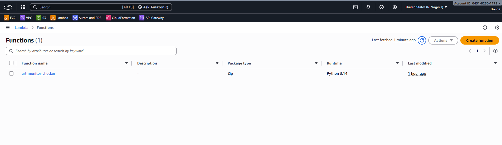
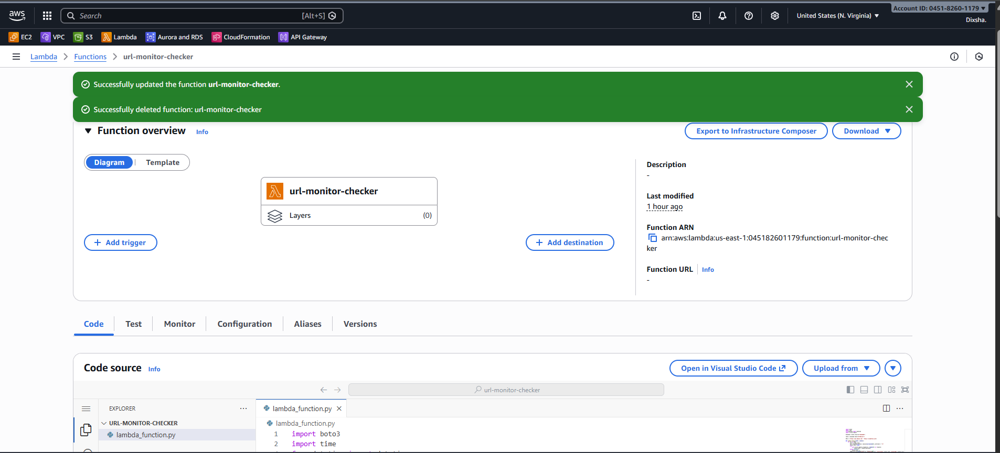
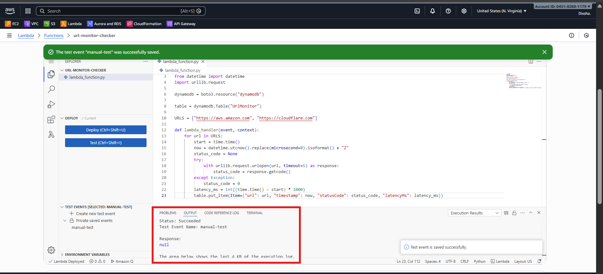
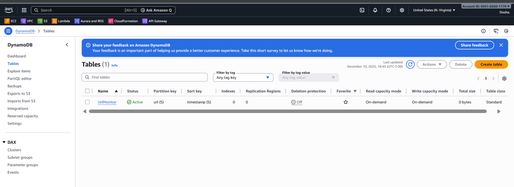
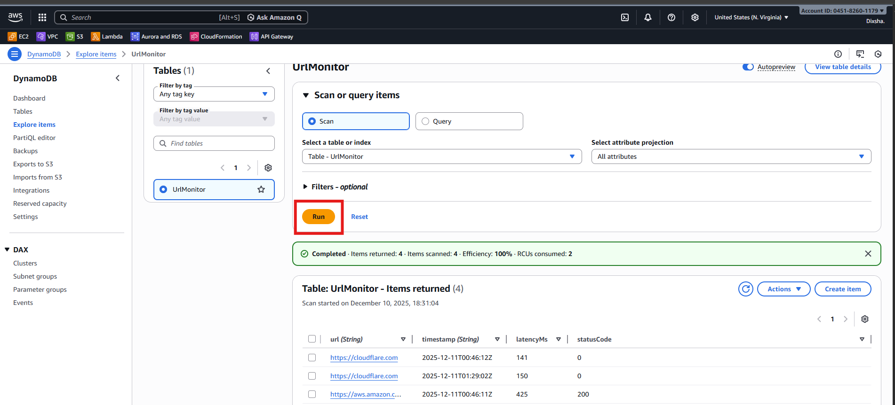
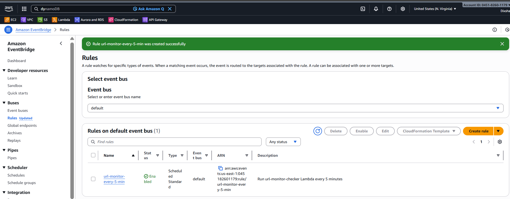
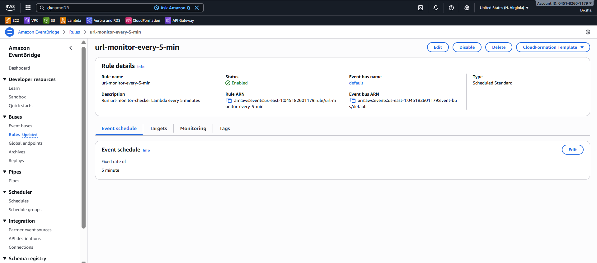
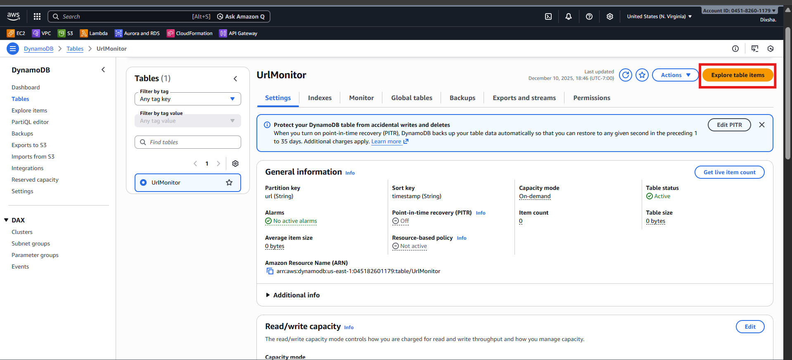
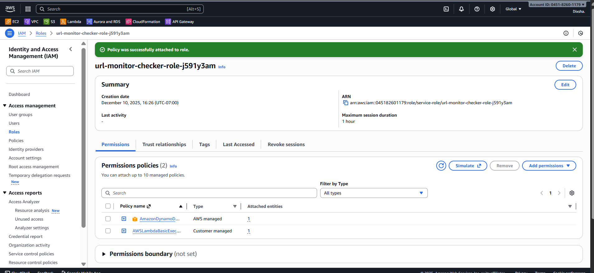

# Serverless-URL-Monitor
A small serverless URL monitoring utility built with AWS Lambda and Amazon DynamoDB. The project stores HTTP check results (status code, latency, timestamp) for target URLs and exposes a simple read endpoint via Lambda Function URL to fetch the latest record for a given url query parameter.

Real-time URL health checking with AWS Lambda + DynamoDB. Query latest status via Function URL.

## Overview
This project stores HTTP response data (status code, latency, timestamp) for target URLs in DynamoDB. A Lambda Function URL endpoint (`GET /?url=...`) returns the most recent record.

## Project Structure
├── README.md # High-level overview
├── lambda/
│ ├── url-monitor-handler.py # Lambda handler code
│ └── requirements.txt # Dependencies
└── screenshots/ # AWS console screenshots

## Technologies Used
- **AWS Lambda** – Serverless Python handler
- **Amazon DynamoDB** – NoSQL table (PK: `url`)
- **Lambda Function URL** – HTTPS endpoint
- **boto3** – AWS SDK for Python

## Features
- Query latest HTTP check: `GET /?url=https://example.com`
- Returns `{url, timestamp, statusCode, latencyMs}`
- Proper 400/404 error responses
- ScanIndexForward=False for newest-first results

## Quick Start
Deploy lambda/url-monitor-handler.py

Create DynamoDB table UrlMonitor (PK: url)

Enable Function URL (Auth: NONE)

Test: https://<function-url>/?url=https://aws.amazon.com

## Screenshots

## Acknowledgments
- AWS Lambda and DynamoDB official documentation
- AWS serverless sample projects on GitHub
- Community tutorials on Lambda Function URLs .

